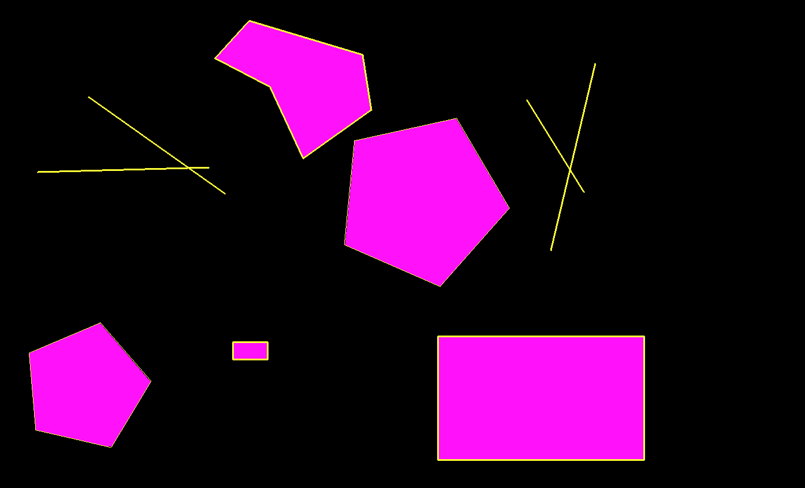

# 2D Computer Graphics project
Implementation of algorithms for 2D graphics with different object modes.

## Shortcuts for control
- **C** - clears current canvas
- **X** - switching between draw modes
- **F and click** - fill in object with color
- **E and 2 clicks** - fill in where first click is selection of border color from canvas and second click where fill should start
- **V** - displays polygon by which all objects will be cut to represent Sutherland-Hodgman algorithm

### Line mode (1. mode)
- lines are created by drag and drop
- **shift** - helps create lines in 45-degree angle

### N gon mode (2. mode)
- points are added by click
- **enter** - finish current n gon
- **S** - scale up polygons
- **R** - rotate polygons
- **T** - translate polygons

### Pentagon mode (3. mode)
- declared by drag and drop
- **S** - scale up polygons
- **R** - rotate polygons
- **T** - translate polygons

### Rectangle mode (4. mode)
- declared by two points from clicks of mouse
